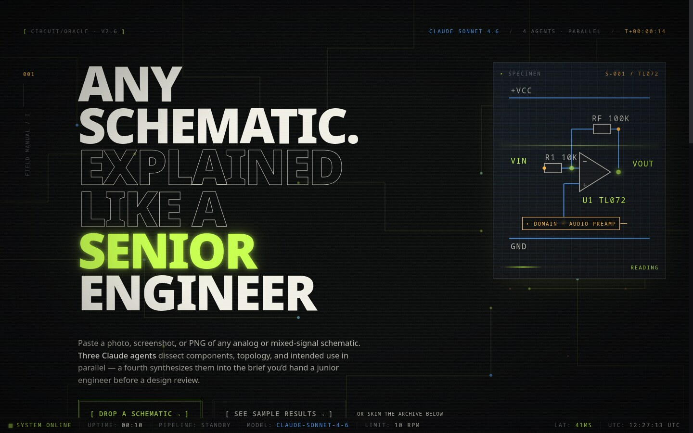
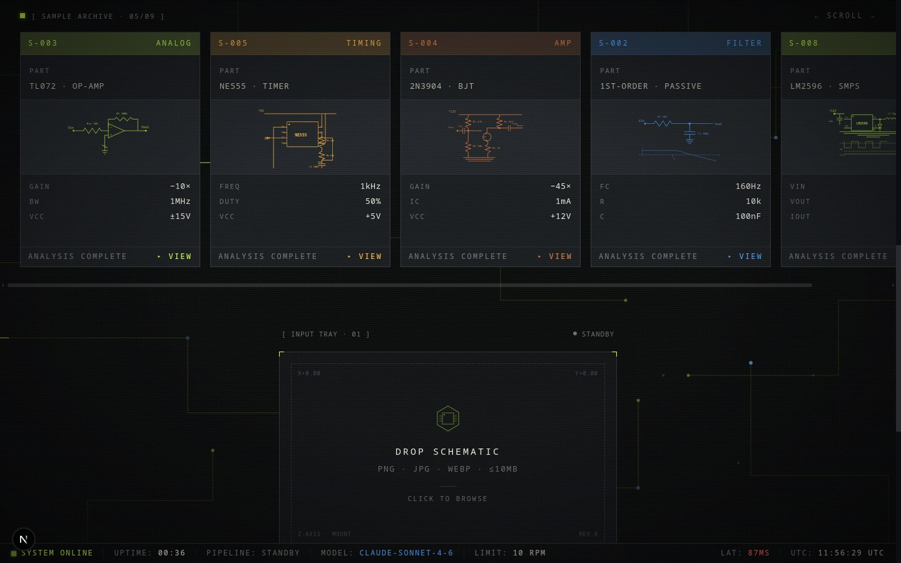
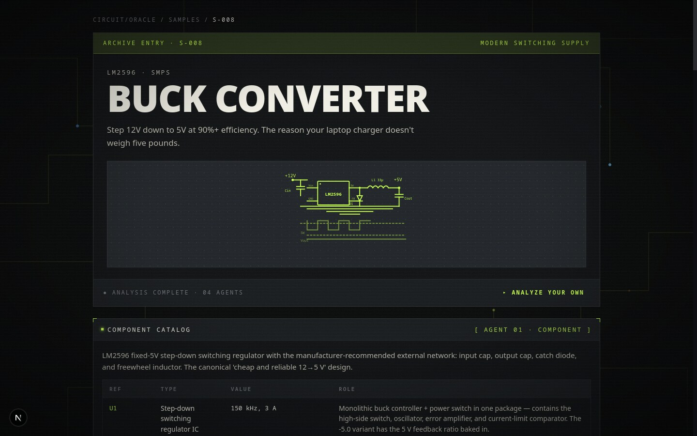

# CircuitOracle

[](https://circuitoracle.vercel.app)
[](https://github.com/ikanquit/circuit-oracle/actions/workflows/ci.yml)
[](https://vercel.com/new/clone?repository-url=https%3A%2F%2Fgithub.com%2Fikanquit%2Fcircuit-oracle&env=GEMINI_API_KEY&envDescription=Google%20Gemini%20API%20key%20with%20vision%20access%20%E2%80%94%20free%20at%20aistudio.google.com&envLink=https%3A%2F%2Faistudio.google.com%2Fapikey)
[](LICENSE)

A multi-agent pipeline that reads circuit schematics the way a senior analog
engineer would.

Drop in a PNG, JPG, or screenshot of a schematic. Three Gemini calls run in
parallel — one catalogs every component, one traces the topology, one
classifies what the circuit is *for* — then a fourth synthesizes a full
engineering review and streams it back token by token.



## Sample analyses, curated

The repo ships with nine hand-authored sample analyses (op-amps, BJT
amplifiers, RC filters, the NE555, an H-bridge, a Wien-bridge oscillator,
and more) so you can read what the pipeline produces without spending an
API call.





## What you get back

For each schematic:

- **Component catalog** — every R, C, U, Q, D on the page with designators,
  printed values (when readable), and functional role.
- **Topology** — the named topology, stages, feedback paths, key nodes, and
  power supply structure.
- **Domain** — primary application area, target frequency range, likely
  impedance envelope, industry context.
- **Synthesis** — a senior-engineer review: operating principle step by step,
  derived parameters (gain, bandwidth, fc), the design rationale, plausible
  failure modes, and what you'd change.

The synthesis pass streams its tokens as it composes, so you watch the
analysis assemble itself instead of staring at a spinner.

## How it works

```
   schematic.png
        │
        ▼
   Promise.allSettled([
     componentAgent,    // counts the parts
     topologyAgent,     // traces the nets
     domainAgent,       // names the purpose
   ])
        │   JSON × 3
        ▼
   synthesisAgent(image + 3 JSON blobs)
        │   token, token, token…
        ▼
   browser  ←  SSE  ←  Next.js Node runtime
```

`Promise.allSettled`, not `Promise.all` — if topology times out, the
synthesizer still receives the component catalog and domain classification.
Partial results beat a 500.

## Quick start

```bash
git clone https://github.com/ikanquit/circuit-oracle.git
cd circuit-oracle
npm install
cp .env.example .env.local        # then add your GEMINI_API_KEY
npm run dev
```

Open <http://localhost:3000>, drop in a schematic image, watch the pipeline
run.

Requires Node 20+ and a Google Gemini API key with vision access — free at
<https://aistudio.google.com/apikey>.

## Scripts

```
npm run dev          dev server on :3000
npm run build        production build
npm start            serve the built app
npm run lint         eslint
npm run type-check   tsc --noEmit
```

## Stack

- Next.js 15 (App Router, React 19)
- Tailwind v4 + custom design tokens in `src/styles/tokens.css`
- Gemini `gemini-2.5-flash` via `@google/genai`
- SSE over `POST` + `ReadableStream` reader (so the request body can carry
  the image — `EventSource` only does GET)
- LRU rate limiter, 10 req / 60 s / IP

No database, no queues, no background workers. The whole thing is one
Next.js route streaming back from three to four concurrent SDK calls.

## Deploy

The fastest path is Vercel — the project is a vanilla Next.js App Router
build, no special infra. Click the button at the top of this README, or:

1. Import the repo at <https://vercel.com/new>.
2. Add `GEMINI_API_KEY` under **Environment Variables**.
3. Deploy. Vercel detects Next.js automatically; no `vercel.json` needed.

The `analyze` route is configured with `runtime = "nodejs"` and
`maxDuration = 60` so synthesis has room to stream. CI runs lint,
type-check, and a full build on every push to `main` and every PR.

## Limits

- 10 MB per image, `image/*` MIME only
- 10 requests per IP per 60 seconds
- `maxDuration = 60s` on the analyze route — synthesis can take 30–45 s on
  dense schematics, so don't tighten this without testing

## Privacy

Images are base64-encoded server-side and forwarded to Google (Gemini API).
They are never logged and never persisted; they live in request memory only.

## License

MIT.
